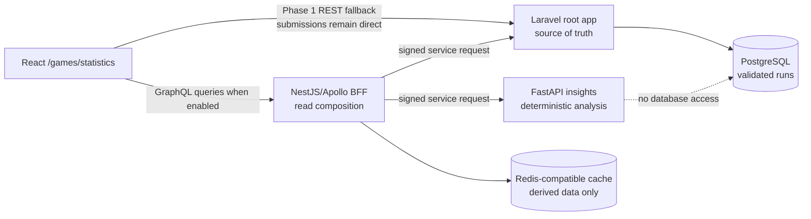

# Phase 2 Plan: Cost-Conscious Polyglot Services

**Status:** Draft for approval; do not implement yet
**Depends on:** Phase 1 verified Square Off runs, replays, and statistics
**UI visible:** `true`
**E2E applicable:** `false` — this repository has no browser E2E harness; use cross-service integration tests plus the required real-browser verification described below.

## Summary

Extend the portfolio into an additive, independently deployable monorepo that demonstrates credible service boundaries without turning the portfolio itself into a fragile distributed system. The Laravel application remains at the repository root and remains the authoritative owner of saved Square Off runs, validation state, replays, and baseline statistics. A Node.js 24 LTS NestJS/Apollo GraphQL backend-for-frontend (BFF) provides a typed read-only aggregation boundary. A Python FastAPI/Pydantic service computes deterministic, derived game insights. A Redis-compatible cache stores only recomputable insight results.

The existing portfolio, resume download, analytics, local games, and Phase 1 Laravel statistics remain usable when every Phase 2 service is absent or unavailable. Phase 2 is a skills demonstration, but each technology must have a defensible job: Laravel owns durable business data and rules, Python owns analysis well suited to a data-oriented service, and the BFF composes client-facing reads. Documentation must say this directly so the architecture does not look like accidental complexity.

No public application endpoint will allow a visitor to delete a validated run. Validated outcomes are immutable evidence; allowing players to selectively remove losses would make the statistics untrustworthy. Public statistics and replay/insight reads include a run only when `validation_status=valid` **and** `moderation_status=included`. Phase 1's operator-only quarantine is the existing inclusion boundary: quarantine preserves the record and outcome but excludes it consistently from public statistics and every Phase 2 read path.

The BFF is query-only in this phase, and neither the BFF nor Python may write to Laravel's database. A quarantined replay receives the same generic unavailable response as an unknown or otherwise unavailable replay and never reaches the BFF result, Python analysis, or Redis cache.

## Goals

- Demonstrate a production-minded polyglot architecture using Laravel/PHP, NestJS/Node.js, GraphQL, FastAPI/Python, generated clients, explicit contracts, caching, CI, and coordinated deployment.
- Preserve Laravel as the single source of truth for game records and baseline statistics.
- Add deeper deterministic Square Off insights without using an LLM or pretending random-AI replay validation can prove that a human did not cheat.
- Keep `/games/statistics` as the stable public page while allowing its data adapter to use Phase 1 REST or the Phase 2 GraphQL BFF.
- Support three cost profiles from the same code and contracts: local/CI only, a zero-base-instance-cost public Render showcase under included limits, and an optional production-like paid topology.
- Keep the portfolio fast and available through cold starts, cache failures, and optional-service failures.
- Preserve the existing single manual GitHub production approval, exact-commit CI requirement, Render monitoring, and manual deployment posture.
- Explain the architectural reasoning, alternatives, operational limits, and costs in repository and public-facing documentation.

## Non-goals

- Relocating the current Laravel/React application from the repository root.
- Splitting the React frontend into a separately hosted static site.
- Replacing Phase 1 features merely because Phase 2 provides another implementation path.
- Proxying resume downloads, analytics ingestion, or game submission through the BFF.
- Giving the BFF or Python service direct database access or a shared database.
- Adding public GraphQL mutations, public run deletion, accounts, identities, leaderboards, or per-player win rates.
- Adding Kafka, Kubernetes, a service mesh, Go/Rust services, an LLM, or event sourcing without a real product requirement.
- Making Redis a source of truth or paying for a persistent cache before measured need.
- Reworking the separate existing analytics endpoint; its hardening is a separate task. New Phase 2 endpoints must still follow the abuse controls in this plan.
- Adding a new Playwright/Cypress harness solely for this phase.

## Current and prerequisite state

Phase 1 must be complete and stable before implementation starts. It is expected to provide:

- Versioned, immutable, canonical Square Off transcripts and transcript digests in PostgreSQL.
- Server-validated `valid`, `pending`, and `invalid` submission state, with public statistics based only on runs whose `validation_status=valid` and `moderation_status=included`.
- The Phase 1 operator quarantine path as the sole moderation inclusion boundary; quarantine excludes a run without deleting or rewriting its result.
- Versioned Laravel REST endpoints for public aggregate statistics and unlisted replay reads.
- A standalone `/games/statistics` React page with a swappable data-access boundary.
- Durable valid-run retention and no visitor-controlled deletion path.

The repository currently keeps Laravel and React at the root, uses Docker Compose for local development, and uses separate PHP/JavaScript checks plus a production Docker build in GitHub Actions. Render auto-deploy is disabled. Production deployment is a manual workflow that verifies the exact `main` commit has passed CI, pauses once at the protected `production` environment, deploys through Render, and monitors the result. Those properties are constraints, not cleanup targets.

Before Phase 2 implementation, verify the actual Phase 1 route names, resource shapes, database constraints, and statistics-page component paths. Adapt the exact file names to those shipped interfaces without changing the responsibilities in this plan.

## Resolved decisions

### Service responsibilities

| Component | Owns | Explicitly does not own |
| --- | --- | --- |
| Root Laravel application | Validated runs, canonical transcripts, operator moderation inclusion state, rules/schema versions, replay capability checks, baseline aggregate statistics, PostgreSQL | Python analysis algorithms, GraphQL presentation, shared cache state |
| NestJS/Apollo BFF (`apps/bff`) | Public read-only GraphQL schema, request shaping, Laravel/Python composition, partial-result semantics, bounded caching | Game validation, game submission, durable data, analytics/resume proxying |
| FastAPI service (`services/insights`) | Deterministic derived metrics from a normalized transcript Laravel has already classified as valid and included | Validity/moderation decisions, database access, player identity, public browser API semantics |
| Redis-compatible cache | Recomputable derived insight responses keyed by immutable input/version | Canonical transcripts, run state, statistics, queues, sessions |

### Why these technologies

- **Laravel remains authoritative** because Phase 1 already expresses the domain rules, persistence, validation workflow, and public REST behavior there. Reimplementing ownership elsewhere would create conflicting truth.
- **Python is used for deeper deterministic analysis** because it provides a credible data-analysis boundary and can evolve independently without affecting game acceptance. It is not introduced merely to perform CRUD already handled well by Laravel.
- **The GraphQL BFF is introduced only after Laravel and Python providers exist** because its value is composition: one stable client query can combine baseline run/statistics data with optional derived insights. It must not become a generic proxy.
- **Redis is a disposable optimization** because analysis is deterministic and keyed by immutable inputs. Cache loss changes latency, not correctness.
- **The monorepo is additive** so contracts, fixtures, CI, and releases remain reviewable together while each runtime retains an independent build and deployment boundary.

### Runtime and topology choices

- Node.js 24 LTS, NestJS, Apollo GraphQL, and schema-first SDL.
- Python FastAPI, Pydantic, `pyproject.toml`, a locked dependency set, Ruff, mypy, and pytest.
- The BFF's initial GraphQL surface is query-only. Public operations cover aggregate statistics, an unlisted replay, and derived insights for that replay.
- The browser continues to submit completed games directly to Laravel. It also continues to call existing analytics and resume endpoints directly.
- A client data gateway behind `/games/statistics` selects `laravel` or `graphql` through application configuration. This is a capability/rollout flag, not a way to change Render service topology.
- Render topology is selected by an infrastructure profile. A public Render service cannot be converted into a private service by an environment flag; moving Python from public/free to private/paid requires provisioning a replacement, verifying it, switching the BFF URL, and then retiring the old service.
- All Render services retain `autoDeployTrigger: off`. Production releases remain manual and commit-pinned.
- Provider contracts support the current and immediately previous consumer contract (`N` and `N-1`) so provider-first deployment and partial rollback are safe.

## Target repository layout

```text
/
├── app/, routes/, resources/, tests/       # Existing Laravel + React app stays here
├── apps/
│   └── bff/                                # NestJS/Apollo public read BFF
├── services/
│   └── insights/                           # FastAPI deterministic analysis service
├── contracts/
│   ├── graphql/                            # Canonical schema-first SDL + operations
│   ├── openapi/                            # Laravel provider spec + FastAPI export
│   ├── schemas/                            # Versioned transcript/result JSON Schemas
│   ├── fixtures/                           # Cross-language compatibility fixtures
│   └── README.md                           # Ownership, generation, compatibility rules
├── infra/
│   ├── compose/                            # Local/CI service profiles
│   └── render/                             # Free and production-like examples/runbooks
└── docs/
    └── architecture/                       # Indexed ADRs and system/deployment docs
```

The root JavaScript package remains the React frontend package. Add the BFF through the repository's existing Yarn workflow without moving frontend source. If Yarn workspaces can be added without changing existing commands or production packaging, use a workspace for `apps/bff`; otherwise keep a dedicated BFF lockfile and document why. Make this choice only after a clean install/build spike proves it does not destabilize the root application.

## Target request flow



For an insight query, Laravel first applies the authoritative `validation_status=valid AND moderation_status=included` boundary. Only then can the BFF receive the authorized, normalized replay representation, derive the cache key from `transcript_digest + analysis_algorithm_version`, and check Redis. On a miss, it calls Python with the normalized transcript and version metadata, validates the response, caches it with a bounded TTL, and returns it alongside Laravel's baseline data. An unknown, unauthorized, or quarantined replay gets the same generic unavailable behavior and is never sent to Python or cached. The raw transcript, replay/read capability, GraphQL variables, and cache value are never written to logs.

## Contracts and compatibility

1. Extend the Phase 1 OpenAPI 3.1 contract for Laravel service-facing replay/statistics reads. The public Phase 1 REST contract remains available for browser fallback; service-facing routes may reuse the same application services/resources but require service authentication. Both contracts define the valid-and-included eligibility rule and generic unavailable behavior for quarantined replays.
2. Keep the normalized transcript and deterministic-insight request/response shapes as versioned JSON Schemas. Include valid, boundary, and invalid fixtures, including the simultaneous-trap/capture rule.
3. FastAPI uses Pydantic models derived from or tested against the shared schemas and exports its OpenAPI document. CI compares the exported document with the checked-in contract.
4. Generate the BFF's Laravel and Python clients from their OpenAPI contracts. Generated files are never hand-edited, and CI fails on generation drift.
5. Store the canonical GraphQL SDL under `contracts/graphql` within the existing Phase 1 `contracts` tree. Generate resolver/client types, React operation types, and a production persisted-operation registry of checked-in named operations and their SHA-256 hashes. CI fails on registry drift.
6. Contract changes are additive within a major version. Providers accept both `N` and `N-1` during rollout. Removing/renaming a field or changing semantics requires a new version and an explicit migration/retirement plan.
7. Return typed GraphQL availability metadata for optional insights (for example, `READY`, `WARMING`, `UNAVAILABLE`, and `NOT_REQUESTED`) rather than converting every optional-provider problem into a failed GraphQL request.

## Security and abuse boundaries

Public browser endpoints are discoverable and scriptable. No frontend key, hidden URL, CORS setting, CSRF token, or browser fingerprint proves that a request came from genuine play. Phase 2 therefore bounds abuse and limits blast radius:

- Keep GraphQL read-only and omit all public deletion/mutation operations.
- In production, accept only checked-in named operations identified by an allowlisted persisted SHA-256 hash. Reject arbitrary operation text, unknown or mismatched hashes, batching, and introspection. Local/CI environments allow unrestricted introspection for development and contract tests; the canonical SDL and operation documentation remain published in the repository.
- Apply per-client and global rate/concurrency budgets, with trusted Render proxy configuration verified before using forwarded addresses. Do not persist raw IP addresses, user agents, or device identifiers.
- Set strict request-body, variables, response-size, pagination, timeout, query-depth, and query-complexity limits as defense in depth for the allowlisted operations. Initial safe defaults should be explicit and environment configurable within hard-coded upper bounds.
- Validate every upstream and downstream payload at the service boundary. Reject unknown/oversized transcript fields before calling Python.
- Redact stack traces and upstream internals from production GraphQL errors while preserving a stable error/reason code and correlation ID.
- Do not put secrets in browser configuration. Aggregate reads need no false client secret; unlisted replay access continues to use Phase 1's high-entropy read capability.
- Authenticate BFF-to-Laravel and BFF-to-Python calls with TLS plus an HMAC envelope over key ID, timestamp, validated request ID, method, canonical path, and body digest. Enforce a short timestamp window, constant-time signature comparison, and overlapping primary/secondary keys for rotation.
- Do not require Redis or another shared nonce store for service authentication. These calls are bounded, idempotent, and read-only; an intercepted valid request can be replayed within the short timestamp window. Document that residual risk explicitly and bound its impact with TLS, narrow service permissions, request/body limits, rate/concurrency budgets, timeouts, and safe caching.
- In the free profile, Python is internet-addressable but accepts only valid signed service calls. In the paid private profile, private networking reduces exposure and HMAC remains defense in depth.
- Store only hashes where a capability must be compared. Never log service secrets, replay capabilities, transcripts, GraphQL variables, IP addresses, or user agents.
- Keep dependency audits, pinned lockfiles, minimal production images, non-root containers where supported, and explicit CORS allowlists.

Validated game records remain permanent, immutable evidence. A run contributes to cumulative statistics only while the Phase 1 operator moderation boundary marks it `included`; quarantine preserves the record and result but removes it consistently from public reads. There is no visitor moderation/deletion capability and no public delete endpoint. If a future legal or operational requirement mandates physical removal, it must be a separately approved, audited operator procedure that also rebuilds affected aggregates; it is not part of this plan.

## Failure, caching, and performance behavior

- The portfolio shell, navigation, local games, resume download, analytics, Phase 1 submission, and Phase 1 statistics must not depend on BFF, Python, or Redis availability.
- Laravel enforces valid-and-included eligibility before returning a replay or aggregate. Quarantined replays receive generic unavailable behavior and never reach Python or any cache key/value; cached insight access is always downstream of a fresh authoritative eligibility check.
- Put strict connect and total timeouts on every BFF upstream. Retry only idempotent reads, at most a small bounded number with jitter, and never create retry multiplication across layers.
- If Python is asleep, the BFF returns Laravel baseline data immediately with `WARMING`; the client performs bounded backoff while retaining visible Phase 1 content.
- If Python remains unavailable, show baseline data and a calm, specific "advanced insights unavailable" state. Do not mark the whole statistics page failed.
- If Redis is unavailable, compute once through Python within the same timeout budget or return the baseline partial response. Never fail correctness because the cache is down.
- Cache keys include transcript digest, ruleset/schema version where relevant, and analysis algorithm version. Cache only successful, schema-valid derived results; use bounded TTLs and no canonical state.
- Bound transcript move counts and response cardinality. Laravel should return indexed metadata separately from a transcript so list/statistics queries do not load every move.
- Use ETags/versioned cache keys for stable reads and pagination with a fixed maximum page size.
- Keep Docker build contexts narrow and CI path-aware so adding services does not make every frontend-only change rebuild every runtime.

## Observability and health

All three services emit single-line structured JSON to stdout/stderr with a consistent minimum envelope: `service`, `environment`, `release_sha`, `request_id`, `correlation_id`, route/operation, outcome, duration, and a stable reason code when degraded. Correlation IDs enter at Laravel or the BFF and propagate to every downstream call and response. Accept a caller-provided ID only after format/length validation; otherwise replace it.

Logs and metrics should expose aggregate counts/latencies for GraphQL operations, Laravel/Python upstream calls, cache hits/misses/errors, timeout/fallback outcomes, validation failures, and service-auth failures. They must not include secrets, capabilities, transcripts, GraphQL variables, IP addresses, or user agents. Use Render logs and workflow summaries initially; do not add paid observability infrastructure without a later decision.

- Keep Laravel's existing `/up` readiness behavior.
- BFF liveness proves its process/event loop is alive. BFF readiness requires its configuration and the authoritative Laravel provider, but **does not** fail merely because optional Python or Redis is unavailable.
- Python liveness proves the process is alive; readiness proves the analysis model/configuration can accept requests.
- Post-deploy smoke checks query liveness, readiness, one baseline GraphQL operation, and one deterministic insight. Also exercise or inject a Python-unavailable scenario in non-production to prove the partial response.
- GitHub workflow summaries include safe Render dashboard/deploy URLs, service name, commit SHA, deploy ID, and final state. They never display deploy-hook URLs, API keys, or service-auth secrets.

## Cost and Render deployment profiles

The Render workspace plan and service compute are separate concerns. The new Hobby workspace allowance is sufficient for these services; no workspace-plan upgrade is required by this architecture. Compute remains billed per paid service. Based on the supplied billing snapshot, the existing baseline is approximately `$7/month` for the Starter Laravel service plus approximately `$6.30/month` for Basic PostgreSQL and disk (`~$13.30/month` total).

| Profile | Topology | Incremental base instance price | Trade-off |
| --- | --- | ---: | --- |
| Local/CI only | BFF, Python, and cache run through local/CI Compose; production stays on Phase 1 Laravel | `$0/month` | Architecture is visible in code/tests but advanced live insights are disabled. |
| Free live showcase | Public Free Render web service for BFF, public Free web service for Python, free/recomputable Key Value if compatible | `$0` base instance cost under included limits | Cold starts, shared Free instance-hour exhaustion, public Python requiring HMAC, bandwidth/build limits or overage, and no private service topology. |
| Production-like | Public Starter BFF plus private Starter Python; recomputable cache starts on the lowest viable tier | About `$14/month` before any paid cache | Warm services and private Python, but roughly doubles current spend. Provision only after explicit approval. |

`$0` describes base instance pricing, not a guaranteed zero bill or full-month availability. Under Render's current published terms, 750 Free instance hours are shared across the workspace each month; two services that stayed awake continuously would require roughly twice that allowance and therefore cannot both cover a full month. Free services suspend after the shared allowance is exhausted. Hobby build minutes and bandwidth also have included limits and may stop work or incur overage under the then-current terms.

Create separate documented Render/Blueprint examples for the free and production-like profiles. Never commit real service IDs, hook URLs, API keys, HMAC keys, or database URLs. Every service must set auto-deploy off. Before provisioning either live profile, recheck live Render pricing and included quotas, verify workspace spend-limit and usage-alert settings, and record the result in the release checklist. Before provisioning any paid resource, also pause for the user's explicit cost/topology approval. Monitor Free instance hours, build minutes, outgoing bandwidth, database size/connections, cache size, and spend rather than assuming the listed allowances will remain sufficient.

Moving from the free to production-like profile is a runbook-driven blue/green-style cutover:

1. Provision the replacement private Python service with matching release and rotated/overlapping HMAC credentials.
2. Verify health, contract version, deterministic fixture output, and BFF reachability in a non-user-facing configuration.
3. Change the BFF's Python base URL, deploy/monitor the BFF, and smoke-test partial and full results.
4. Retire the old public Python service only after a soak period and explicit confirmation.

Do not delete or mutate the original service as the first migration step because Render service type is immutable.

## Manual release strategy

- CI runs automatically on pull requests and pushes to `main`, with path-aware service jobs and an always-reporting aggregate required check.
- The deploy workflow remains manually dispatched and first verifies a successful CI run for the exact requested `main` commit.
- The protected GitHub `production` environment remains the **single** approval gate. Do not add a second approval for monitoring or for each service.
- Resolve the changed components and compatible deployment order before the approval. Deploy providers before consumers when their contracts change: Laravel provider, then Python provider, then BFF, then the root Laravel/React image when its UI consumes the new BFF behavior. Skip genuinely unaffected services while still reporting why.
- Trigger and monitor each Render deploy as a distinct workflow step/job so a failure identifies the service and phase. Do not deploy a dependent consumer after a required provider fails.
- Pin every service deployment to the same approved commit SHA or documented compatible release SHA. Record Render deploy IDs and safe dashboard links in the workflow summary.
- Run post-deploy contract/health/smoke checks. A Python/cache degradation can be accepted only if the BFF correctly returns Phase 1 data and the release criteria explicitly allow degraded advanced insights.
- Roll back consumers before providers when necessary. `N`/`N-1` provider compatibility must keep the previous BFF functional during rollback. Use Render's last successful image/deploy and rerun smoke checks; never roll back the database with destructive migrations.

## Implementation sequence

Each stage ends with its listed tests green and a reviewable checkpoint. Do not provision or deploy hosted services while implementing earlier stages.

### Stage 0 — Verify prerequisites and record boundaries

- Confirm Phase 1 route/resource names, schema/rules versions, transcript digest semantics, operator quarantine/included-only behavior, no visitor-delete behavior, statistics adapter seam, and baseline test status.
- Measure representative transcript/result sizes and baseline `/games/statistics` response timing.
- Record ADRs for service boundaries, BFF purpose, deterministic Python analysis, and cost/topology profiles before scaffolding services.
- Decide the Yarn workspace versus isolated BFF lockfile approach through a reversible install/build spike; preserve all existing root commands.
- Pause if Phase 1 lacks an immutable normalized transcript, the operator quarantine/included-only boundary, or a stable versioned read contract.

### Stage 1 — Establish shared contracts and compatibility gates

- Extend the Phase 1 `/contracts` tree with the Laravel service-facing OpenAPI 3.1 document, deterministic-insight JSON Schemas, schema-first GraphQL SDL, compatibility fixtures, and ownership/versioning documentation; do not create a parallel contracts root.
- Add reproducible generation commands for BFF provider clients, GraphQL resolver/browser types, and the persisted-operation hash registry.
- Add CI drift and backward-compatibility checks. Keep generated artifacts scoped and clearly marked.
- Include simultaneous-capture, maximum-length, PVP, every PVE difficulty/version, and valid/included versus quarantined fixture cases.

### Stage 2 — Add the Laravel provider boundary

- Add versioned, read-only, service-facing controllers under the existing API conventions. Reuse Phase 1 application services/resources; do not duplicate rules or query logic in controllers.
- Add timestamped HMAC verification over key ID/request ID/method/path/body digest, short-window checks, overlapping key rotation, request/correlation ID handling, rate/concurrency budgets, strict payload limits, and structured/redacted logs. Do not add a Redis-backed nonce requirement.
- Return normalized, versioned DTOs only after enforcing `validation_status=valid AND moderation_status=included`; return the same generic unavailable response for quarantined and missing replays. Do not expose database models or grant BFF/Python database access.
- Preserve Phase 1 public REST responses and all existing resume/analytics/submission routes exactly.

### Stage 3 — Build deterministic Python insights

- Scaffold `services/insights` with FastAPI, Pydantic, locked dependencies, Ruff, mypy, pytest, health endpoints, and a production container.
- Implement a bounded set of explainable deterministic analyses over transcripts Laravel has already classified as valid and included, such as capture/lead timelines, control swings, move-phase summaries, and pivotal-move candidates. Do not use an LLM or claim to detect cheating.
- Validate against shared fixtures and algorithm-version every response.
- Add the same timestamped short-window HMAC policy, overlapping key rotation, correlation propagation, rate/concurrency and input/response limits, timeouts, and redacted JSON logging. Keep the documented within-window replay risk limited to idempotent read-only calls without making Redis a security dependency.
- Keep the service stateless and database-free.

### Stage 4 — Build the read-only GraphQL BFF

- Scaffold `apps/bff` with NestJS/Apollo, Node.js 24 LTS, schema-first SDL, generated provider clients/types, health endpoints, and a production container.
- Implement aggregate statistics, unlisted replay, and replay-insight queries. The schema has no mutation type in this phase.
- Compose Laravel baseline data with optional Python results and typed partial-availability states. Never call Python or Redis when Laravel returns the generic unavailable result for a missing, unauthorized, or quarantined replay.
- Add cache-aside behavior keyed by transcript digest and algorithm version; cache failure must not become a correctness failure.
- In production, execute only allowlisted persisted SHA-256 hashes for checked-in named operations; reject arbitrary operations, hash mismatches, batching, and introspection. Allow unrestricted introspection in local/CI, keep the SDL documented in-repo, and retain depth/complexity/page/body/response/timeout limits, rate/global budgets, CORS, error redaction, and request correlation as defense in depth.

### Stage 5 — Integrate the stable statistics page

- Add a GraphQL implementation behind the Phase 1 `/games/statistics` data gateway and expose only the required endpoint/capability configuration to the browser.
- Keep the Phase 1 Laravel adapter intact. With GraphQL disabled or unavailable, the existing page and baseline statistics continue to work.
- Add user-readable `warming`, `advanced insights unavailable`, retry, and partial-result states without hiding baseline content.
- Add a concise public "How it works" section that explains validation, deterministic analysis, privacy, and why the optional services exist without marketing jargon.

### Stage 6 — Local orchestration and CI

- Add Compose profiles for the root app dependencies, BFF, Python, and disposable Redis-compatible cache with health checks and documented startup commands.
- Keep current `./docker-reboot` behavior intact unless the user explicitly approves expanding it; provide an additive command/profile for the full lab stack.
- Add path-aware BFF/Python/contract checks while preserving stable required CI check behavior. Contract changes trigger every affected provider and consumer test.
- Add narrow Docker contexts and no-push production-image builds for each deployable service.
- Add an integration smoke harness that starts the stack, exercises GraphQL composition/cache behavior, and proves Python/cache degradation.

### Stage 7 — Prepare zero-base-instance-cost live profile

- Add sanitized free-profile Render configuration and a runbook; keep all auto-deploy triggers off.
- Recheck live pricing and included quotas, record the shared 750-hour implication for two services, and verify spend-limit plus usage-alert settings before provisioning or deploying.
- Add environment validation that fails startup clearly when URLs/key IDs/secrets are missing, without logging values.
- Extend the manual workflow for dependency-aware, exact-commit, one-approval deploy/monitor/smoke behavior and safe deployment links.
- Deploy only after separate user approval. Verify cold-start/warming behavior from a real browser and retain the Phase 1 fallback flag for instant rollback.

### Stage 8 — Optional production-like profile

- Recheck current Render pricing and usage, then pause for explicit approval of approximately `$14/month` incremental compute before provisioning.
- Provision the public Starter BFF and replacement private Starter Python according to the cutover runbook.
- Verify service auth, private reachability, readiness semantics, full/degraded smoke tests, and rollback before retiring the free Python service.
- Do not make this paid profile a prerequisite for considering Phase 2 code complete.

### Stage 9 — Documentation, proof, and handoff

- Finish architecture docs, service runbooks, contract-generation docs, failure/cost matrix, release/rollback instructions, and public case-study copy.
- Capture API/log proof for timestamped service authentication (including tampered/expired rejection and documented bounded within-window replay), contract compatibility, moderation exclusion, persisted-operation enforcement, cache/fallback behavior, and deploy monitoring.
- Run real-browser verification of `/games/statistics` at supported viewport sizes with GraphQL ready, warming, unavailable, and flag-disabled states.
- Complete the repository's self-review loop before any commit/push, preserving the user's review/approval gates.

## Expected file and directory scope

Implementation is expected to stay within these areas (adapt Phase 1 paths to their actual names):

- `apps/bff/**`
- `services/insights/**`
- `contracts/**`
- `infra/compose/**`, `infra/render/**`, and additive Compose configuration at the root
- `app/Http/Controllers/Api/V1/**`, `app/Http/Middleware/**`, `app/Services/**`, `app/Http/Resources/**`
- `routes/api.php`, relevant `config/*.php`, `.env.example`
- The Phase 1 statistics data gateway/components under `resources/js/**` and generated GraphQL operation types
- `package.json`, `yarn.lock`, TypeScript/code-generation configuration only as required for the additive BFF workspace/tooling
- `composer.json`/`composer.lock` only if a justified contract/security dependency is needed
- `.github/workflows/ci.yml`, `.github/workflows/deploy.yml`, and narrowly scoped workflow helper scripts/tests
- Service Dockerfiles and `.dockerignore` files; the existing production Docker path must remain valid
- `README.md`, `AGENTS.md`, `docs/architecture/**`, and service/contract READMEs
- PHP, TypeScript, Python, contract, integration, and frontend tests corresponding to these changes

Do not refactor unrelated portfolio content, Blade SPA hooks, games, navigation, or existing route behavior while implementing this plan.

## Acceptance criteria and mapped tests

Every acceptance criterion is behavioral and must be covered by the listed automated checks. The browser proof supplements rather than replaces those tests.

### AC2.1 — Existing application remains independent

**Given** Phase 2 services are not configured, disabled, asleep, or unreachable
**When** a visitor loads the portfolio, plays/submits a game, downloads the resume, records an allowed analytics event, or opens `/games/statistics`
**Then** existing flows and Phase 1 baseline statistics continue to work, and optional advanced insights show a bounded non-blocking state.

Mapped tests: `T2-FE-01`, `T2-INT-01`, `T2-PHP-01`.

### AC2.2 — Laravel remains the source of truth

**Given** runs across validation and moderation states plus an unlisted replay capability or aggregate-statistics request
**When** the BFF requests canonical data or a previously included run is operator-quarantined
**Then** Laravel returns a versioned normalized representation only when `validation_status=valid AND moderation_status=included`; pending, invalid, excluded, and quarantined runs are absent from statistics, quarantined replays receive the same generic unavailable result as missing replays, no excluded transcript reaches BFF/Python/cache, and neither downstream service can access PostgreSQL directly.

Mapped tests: `T2-PHP-02`, `T2-PHP-05`, `T2-CONTRACT-01`, `T2-ARCH-01`, `T2-INT-09`.

### AC2.3 — Deterministic Python analysis

**Given** the same normalized transcript, ruleset/schema version, and analysis algorithm version
**When** the Python service analyzes it repeatedly
**Then** it returns the same schema-valid derived insights without reading a database, changing validity, or using nondeterministic/LLM behavior.

Mapped tests: `T2-PY-01`, `T2-PY-02`, `T2-CONTRACT-02`.

### AC2.4 — Typed GraphQL composition

**Given** Laravel and Python are healthy
**When** the browser issues an allowed statistics/replay insight operation
**Then** the schema-first BFF returns baseline Laravel data plus typed deterministic insights and generated client types match the checked-in schema.

Mapped tests: `T2-BFF-01`, `T2-CONTRACT-03`, `T2-INT-02`.

### AC2.5 — Graceful optional-service degradation

**Given** Laravel is healthy but Python is cold, times out, or fails
**When** the same GraphQL operation runs
**Then** the BFF returns baseline data with a typed `WARMING` or `UNAVAILABLE` insight state within its total timeout budget, and the page retains usable baseline content with bounded retry behavior.

Mapped tests: `T2-BFF-02`, `T2-FE-02`, `T2-INT-03`.

### AC2.6 — Disposable cache behavior

**Given** a valid insight request
**When** a matching digest/algorithm-version cache entry exists, is absent, is stale, or Redis is unavailable
**Then** the BFF uses only a matching valid entry, computes on a miss when budget allows, never serves a different algorithm version, and still returns a correct partial response when cache access fails.

Mapped tests: `T2-BFF-03`, `T2-INT-04`.

### AC2.7 — Service calls are authenticated with bounded replay exposure

**Given** a Laravel or Python service-facing request
**When** its timestamped HMAC is valid, invalid, expired, signed with an overlapping rotation key, or replayed within the accepted clock window
**Then** tampered and expired requests are rejected, accepted calls remain idempotent and read-only, the documented within-window replay risk is bounded by TLS and rate/concurrency/request limits, Redis is not required for authentication, failures use stable redacted reason codes, and no secret/capability/body appears in logs.

Mapped tests: `T2-PHP-03`, `T2-PY-03`, `T2-SEC-01`.

### AC2.8 — Public GraphQL abuse is bounded

**Given** anonymous callers can discover the GraphQL endpoint
**When** production receives arbitrary query text, an unknown/mismatched persisted hash, batching, introspection, or a request exceeding body, variable, depth, complexity, pagination, response, concurrency, or rate limits
**Then** it is rejected before expensive downstream work with a stable safe error and correlation ID; only checked-in named operations with allowlisted SHA-256 hashes execute in production, while local/CI introspection remains unrestricted.

Mapped tests: `T2-BFF-04`, `T2-BFF-06`, `T2-CONTRACT-03`, `T2-SEC-02`, `T2-INT-05`.

### AC2.9 — Statistics cannot be curated by deleting losses

**Given** valid-and-included runs feed permanent cumulative statistics
**When** route and GraphQL schemas are inspected, a caller attempts a delete/mutation request, or an operator quarantines a run through Phase 1's existing moderation boundary
**Then** no visitor delete/moderation capability, REST delete route, or GraphQL mutation exists; BFF/Python access is read-only; and operator quarantine excludes the immutable run consistently without letting a visitor curate outcomes.

Mapped tests: `T2-PHP-04`, `T2-PHP-05`, `T2-BFF-05`, `T2-ARCH-02`, `T2-INT-09`.

### AC2.10 — Contracts remain compatible during release

**Given** current (`N`) and previous (`N-1`) provider/consumer fixtures
**When** contracts and generated clients are validated in CI
**Then** both supported versions pass, stale generated code fails the build, and a breaking change cannot merge without an explicit new-version migration plan.

Mapped tests: `T2-CONTRACT-04`, `T2-CI-01`.

### AC2.11 — Health and telemetry distinguish failures

**Given** healthy, Laravel-down, Python-down, and Redis-down states
**When** health checks and a correlated request run
**Then** liveness/readiness reflect required versus optional dependencies, correlation propagates across services, logs expose safe timings/outcomes, and sensitive fields are absent.

Mapped tests: `T2-OBS-01`, `T2-INT-06`, `T2-SEC-03`.

### AC2.12 — Local stack is reproducible without changing normal startup

**Given** a clean checkout with documented dependencies
**When** a developer runs the additive full-lab Compose command
**Then** Laravel, BFF, Python, PostgreSQL, and disposable cache become healthy and the integration smoke passes, while the existing `./docker-reboot` workflow retains its prior behavior unless separately approved.

Mapped tests: `T2-INT-07`, `T2-CI-02`.

### AC2.13 — CI is path-aware but complete

**Given** frontend-only, Laravel-only, Python-only, BFF-only, and contract changes
**When** CI evaluates changed paths
**Then** it runs every affected lint/type/test/build/contract job, contract changes fan out to providers and consumers, production images build without push, and the stable aggregate required check always reports.

Mapped tests: `T2-CI-03`, `T2-CI-04`.

### AC2.14 — Production releases use one controlled approval

**Given** a successful automatic CI run for an exact `main` commit
**When** an approved operator manually dispatches deployment
**Then** GitHub asks for one production approval, deploys/monitors affected providers before consumers, stops dependents after a required failure, runs smoke checks, and reports safe Render deploy links and final states.

Mapped tests: `T2-DEPLOY-01`, `T2-DEPLOY-02`.

### AC2.15 — Cost profiles are selectable without code forks

**Given** the same commit, images, and contracts
**When** an operator follows the local-only, free-live, or production-like profile
**Then** documented environment/topology configuration selects that profile, all Render services have auto-deploy off, no secret is committed, the free profile is described only as `$0` base instance cost under included limits, the shared 750 Free instance hours/suspension and Hobby build-minute/bandwidth constraints are checked against live pricing, spend-limit and usage-alert settings are verified, and a paid/private migration requires explicit cost approval plus replacement-service cutover.

Mapped tests: `T2-INFRA-01`, `T2-INFRA-02`, `T2-INFRA-03`, `T2-SEC-04`.

### AC2.16 — The stable page can roll forward and back

**Given** `/games/statistics` is configured for either Laravel REST or GraphQL
**When** the data-source flag changes or the BFF becomes unavailable
**Then** the same route and presentation remain usable, no page reload loop occurs, and reverting to the Phase 1 adapter requires no data migration.

Mapped tests: `T2-FE-03`, `T2-INT-08`, `T2-BROWSER-01`.

### AC2.17 — Architectural intent is explicit

**Given** a reviewer enters through the root README, a service README, the contract index, or `/games/statistics`
**When** they look for the reason behind Laravel, BFF, Python, GraphQL, cache, and Render profile choices
**Then** they can find concise ownership, alternatives, consequences, failure behavior, and cost rationale, including that the polyglot shape intentionally demonstrates integration skills without unnecessary spend.

Mapped tests: `T2-DOC-01`, `T2-BROWSER-02`.

## Test plan

### PHP/Laravel

- `T2-PHP-01`: Feature regression tests for existing Phase 1, resume, analytics, and SPA routes with Phase 2 configuration absent.
- `T2-PHP-02`: Feature/data tests for valid-and-included-only normalized replay/statistics service resources, version fields, caps, and query behavior.
- `T2-PHP-03`: HMAC middleware tests covering canonical key-ID/timestamp/request-ID/method/path/body-digest signatures, clock bounds, constant-time validation, overlapping key rotation, malformed input, bounded repeat requests within the accepted window, no Redis dependency, and redacted errors.
- `T2-PHP-04`: Route/schema assertion that no public run deletion endpoint exists and service credentials cannot invoke writes.
- `T2-PHP-05`: Validation/moderation status-matrix tests proving only `valid + included` contributes to statistics or replay reads, and a quarantined replay uses the same generic unavailable response as a missing replay.

### Python/FastAPI

- `T2-PY-01`: Parameterized pytest golden fixtures for deterministic metrics across PVP/PVE, rules versions, captures, ties, and simultaneous traps.
- `T2-PY-02`: Property/boundary tests for schema limits, stable ordering, repeated identical outputs, maximum transcript, and no external/database dependency.
- `T2-PY-03`: FastAPI tests for canonical timestamped signatures, clock bounds, overlapping key rotation, documented repeat-within-window behavior for idempotent reads, rate/concurrency limits, no Redis authentication dependency, validation errors, health, and correlation propagation.

### NestJS/Apollo BFF

- `T2-BFF-01`: Resolver/service integration tests using generated mocked providers for baseline plus insight composition and unlisted capability forwarding without logging it.
- `T2-BFF-02`: Timeout/cold-start/failure tests proving typed partial results and a bounded total latency/retry budget.
- `T2-BFF-03`: Cache tests for key composition, hit/miss, TTL, schema/algorithm mismatch, invalid-result rejection, and Redis failure.
- `T2-BFF-04`: GraphQL security tests for body, depth, complexity, variables, pagination, response, rate, concurrency, and redacted errors around allowed operations.
- `T2-BFF-05`: Schema/resolver assertion that no mutation or deletion surface exists and provider clients expose only required reads.
- `T2-BFF-06`: Environment-policy tests proving production accepts only allowlisted persisted SHA-256 hashes for checked-in named operations and rejects arbitrary text, unknown/mismatched hashes, batching, and introspection, while local/CI permits unrestricted introspection.

### Frontend

- `T2-FE-01`: Vitest/RTL regression tests for Phase 1 adapter and baseline page content when Phase 2 is absent.
- `T2-FE-02`: Component tests for ready, warming, unavailable, timeout, retry exhaustion, and partial insight states while baseline content remains visible.
- `T2-FE-03`: Data-gateway tests for explicit REST/GraphQL selection, safe fallback, stable route, request cancellation, and no retry loop.

### Contracts, architecture, security, and observability

- `T2-CONTRACT-01`: Laravel payload validation against OpenAPI/JSON Schema plus normalized fixture parity.
- `T2-CONTRACT-02`: FastAPI request/response and exported OpenAPI validation against shared schemas.
- `T2-CONTRACT-03`: GraphQL SDL parsing/code generation, named-operation validation, deterministic persisted SHA-256 registry generation/drift detection, and generated-client compilation.
- `T2-CONTRACT-04`: `N`/`N-1` compatibility suite and generated-artifact drift check.
- `T2-ARCH-01`: Automated dependency/static check preventing BFF/Python database drivers, database URLs, or root-app source imports.
- `T2-ARCH-02`: API inventory/schema snapshot verifying read-only Phase 2 boundaries, immutable outcomes, and Phase 1's operator quarantine as the only included/excluded moderation boundary.
- `T2-SEC-01`: Cross-language HMAC vectors for key ID/timestamp/request ID/method/path/body digest, clock rejection, overlapping key rotation, constant-time comparison, explicit within-window replay behavior, idempotent read scope, and independence from Redis.
- `T2-SEC-02`: Load/budget test proving rejected GraphQL work does not invoke providers.
- `T2-SEC-03`: Log-capture assertions for secrets, replay capabilities, transcripts, variables, IP, and user-agent redaction.
- `T2-SEC-04`: Secret scan and Render/Compose environment-template checks.
- `T2-OBS-01`: Structured-log schema, request/correlation propagation, required fields, outcome/reason codes, and health-dependency tests.

### Integration, CI, infrastructure, and deployment

- `T2-INT-01`: Full-stack smoke with Phase 2 containers stopped, proving existing/Phase 1 flows.
- `T2-INT-02`: Full-stack GraphQL query returning Laravel data plus deterministic Python insight.
- `T2-INT-03`: Python cold/unavailable simulation proving prompt partial response and bounded UI retry contract.
- `T2-INT-04`: Cache hit/miss and cache-down simulation with identical correctness.
- `T2-INT-05`: Oversized/complex GraphQL request rejected before provider calls.
- `T2-INT-06`: Required/optional dependency health matrix and end-to-end correlation ID.
- `T2-INT-07`: Clean Compose-profile startup, health convergence, and teardown without changing the legacy startup path.
- `T2-INT-08`: Runtime configuration rollback from GraphQL to Phase 1 REST without data changes.
- `T2-INT-09`: Full-stack status-boundary test that quarantines a previously included run, confirms removal from statistics, receives generic unavailable replay behavior, and proves no subsequent Python invocation or Redis read/write occurs.
- `T2-CI-01`: Contract version/generation gate exercised with a deliberate incompatible fixture in the test harness.
- `T2-CI-02`: Container configuration validation and service health smoke.
- `T2-CI-03`: Changed-path decision unit tests for each component and shared-contract fan-out.
- `T2-CI-04`: Every runtime's lint/type/test/audit/build plus no-push production Docker build and stable aggregate status.
- `T2-INFRA-01`: Parse/policy-test free and paid Render examples for service type, plan, health path, auto-deploy off, absent secrets, and no false zero-cost guarantee.
- `T2-INFRA-02`: Test/document the replacement-service topology cutover; an environment flag alone must not claim to change public/private type.
- `T2-INFRA-03`: Documentation/release-checklist test requiring a live pricing recheck, the shared 750 Free instance-hour and suspension warning, Hobby build-minute/bandwidth limit or overage language, and verified spend-limit/usage-alert settings.
- `T2-DEPLOY-01`: Workflow logic tests with mocked CI/Render responses for exact SHA, one approval, provider order, stopping on failure, monitoring, and rollback order.
- `T2-DEPLOY-02`: Non-production dry run or disposable-service proof showing deploy IDs/states and safe links in summaries without secret leakage.
- `T2-DOC-01`: Documentation link/checklist test covering every required ADR, service ownership section, contract command, cost profile, failure matrix, and rollback runbook.

### Required real-browser and API proof

- `T2-BROWSER-01`: In a real browser, capture `/games/statistics` with GraphQL fully ready, Python warming, Python unavailable, and GraphQL disabled/REST fallback. Confirm baseline content remains aligned, readable, interactive, and free of console/network retry storms at desktop and mobile widths.
- `T2-BROWSER-02`: Verify the public "How it works" explanation is discoverable and accurately describes validated data, deterministic analysis, service roles, privacy, and optional-service degradation.
- Capture equivalent API/log proof for tampered/expired HMAC rejection, accepted idempotent repeat within the documented short window, rate/concurrency bounding without Redis as an auth dependency, operator-quarantine exclusion, persisted-operation rejection, a shared correlation ID across all three services, cache hit/miss, and safe deploy monitoring.
- Because no E2E harness exists, record this proof in the implementation handoff/PR. Do not describe unit or integration tests as browser verification.

## Documentation deliverables

Documentation is part of the feature, not an afterthought:

- Update the root `README.md` with a compact architecture overview, supported run/test commands, deployment profiles, current monthly baseline, optional incremental costs, and links to deeper docs.
- Add an index under `docs/architecture/` and ADRs covering:
  - why validated run ownership remains in Laravel;
  - why Python performs deterministic analysis and does not validate games;
  - why a GraphQL BFF is justified by provider composition and is not a generic proxy;
  - why Redis is disposable and what happens when it fails;
  - why the monorepo is additive and the root application is not relocated;
  - why public/free and private/paid Render profiles exist and what the cutover costs;
  - why there is no visitor deletion path for statistical records and why Phase 1 operator quarantine is the only included/excluded boundary;
  - why short-window HMAC for idempotent read-only calls accepts a bounded residual replay risk instead of making disposable Redis a security dependency;
  - why production GraphQL uses checked-in named persisted operations while local/CI keeps introspection available;
  - service authentication, contract versioning, Render Free allowance/spend controls, partial failure, release, and rollback decisions.
- Each ADR records context, alternatives considered (including "keep everything in Laravel"), decision, consequences, cost constraints, and a reversal trigger.
- Add `apps/bff/README.md` and `services/insights/README.md` with "owns / does not own," why this language/framework fits the responsibility, local commands, contracts, configuration, failure modes, observability, and deploy/rollback steps.
- Add `contracts/README.md` with canonical sources, generation commands, generated-file locations, fixture rules, and `N`/`N-1` compatibility policy.
- Add a public, concise `/games/statistics` "How it works" or case-study section. It should clearly frame the services as a cost-conscious engineering demonstration that still uses appropriate integration boundaries.
- Use code comments/PHPDoc only for non-obvious invariants and trade-offs. Follow repository PHPDoc requirements for every PHP class, method, declared property, and class constant; do not add narrative comment noise that belongs in ADRs.

## Domain review disposition

| Domain | Adopted requirements | Rejected/deferred and why |
| --- | --- | --- |
| Security | Timestamped short-window HMAC for idempotent reads, overlapping key rotation, explicit bounded within-window replay risk, persisted named GraphQL operations in production, public budgets, strict validation, redaction, no browser secrets, no visitor deletion | A shared nonce/Redis replay store is rejected because Redis is optional/disposable and the read-only residual risk is bounded; accounts/fingerprints are disproportionate; analytics hardening is separate. |
| Accessibility | Stable `/games/statistics`, textual partial states, no loss of baseline content, browser verification | Broader Square Off/replay/statistics WCAG remediation belongs to Phase 3; Phase 2 must not regress it. |
| Observability | Structured JSON, safe correlation, dependency/fallback/cache outcomes, distinct health, deploy summaries | Paid APM/distributed tracing backend deferred until measured need; correlation and Render logs are sufficient initially. |
| Data safety | Laravel-only PostgreSQL ownership, immutable outcomes, valid-and-included reads, operator quarantine, versioned transcript/digest, disposable cache, no public delete | Shared database and visitor deletion are rejected because they break ownership and statistical integrity; quarantine excludes without rewriting/deleting. |
| API compatibility | OpenAPI/JSON Schema/SDL, generated clients, fixtures, `N`/`N-1`, provider-first rollout | Breaking in-place schema changes rejected. |
| Performance | Narrow payloads, limits, cache-aside, strict timeouts, bounded retry, graceful partial results, path-aware CI | Always-warm services deferred to the explicitly paid profile. |
| Architecture | Additive monorepo, Laravel authority, Python-derived analysis, BFF-only composition, no direct DB reads | Static-site split, generic BFF proxy, Kafka/Kubernetes/service mesh/extra languages rejected as unjustified baseline complexity. |
| Cost/operations | Three profiles, no workspace upgrade, `$0` only as base instance cost under included limits, shared 750-hour/suspension disclosure, live price recheck, spend/usage controls, explicit paid checkpoint, manual commit-pinned deploy, one approval | Automatic deployment, zero-cost guarantees, and silent paid provisioning rejected. |

## Risks and mitigations

| Risk | Mitigation |
| --- | --- |
| The project looks over-engineered for a portfolio | Keep boundaries narrow, document alternatives/consequences, retain Phase 1 fallback, and expose concrete failure/cost reasoning publicly. |
| Free-service cold starts or shared-hour suspension make the demo look broken | Return baseline data immediately, model `WARMING`/unavailable states, disclose shared-hour limits, use bounded retry, and retain a flag to use Laravel REST only. |
| Anonymous callers create cost or load | Read-only API, strict multi-dimensional limits, global concurrency budgets, cache immutable results, small payloads, timeouts, and monitoring. |
| HMAC keys leak, signatures differ, or a valid read is replayed inside the clock window | Shared canonical vectors, secret scanning, no log bodies, overlapping rotation keys, TLS, narrow read-only permissions, strict limits, and explicit residual-risk documentation; Redis remains optional. |
| Contract drift breaks coordinated releases | Canonical contracts, generated clients, `N`/`N-1` fixtures, provider-first deploy, and consumer-first rollback. |
| Redis becomes accidental state | Store derived results only and prove cache-down correctness in integration tests. |
| BFF/Python accidentally gain data ownership | Static dependency checks, no DB credentials/drivers, read-only service APIs, architecture tests, and ADRs. |
| Added services consume shared Render hours, build minutes, bandwidth, or unexpected spend | Recheck live pricing/quotas, verify spend limits and usage alerts, describe Free as base-cost-only, monitor usage, and obtain explicit approval before any paid service. |
| Public-to-private migration causes downtime | Provision replacement, verify, switch BFF, soak, then retire old service; never mutate/delete first. |
| Multi-service CI slows ordinary content changes | Path-aware jobs, narrow build contexts, shared-contract fan-out only when needed, and an always-reporting aggregate check. |

## Rollout, rollback, and pause points

### Rollout

1. Merge contracts and provider-compatible Laravel reads with the UI still on Phase 1 REST.
2. Merge/test Python, then BFF, locally and in CI; keep GraphQL capability disabled in production.
3. Recheck live Render pricing/allowances, verify spend-limit and usage-alert settings, record the shared 750-hour impact, and obtain explicit approval before creating the free live Render services, secrets, or workflow changes that contact them.
4. Deploy providers then BFF, verify full/degraded behavior, and enable GraphQL only for the statistics-page adapter.
5. Observe logs, latency, cold starts, cache behavior, build minutes, bandwidth, and errors before making it the default.
6. Treat the production-like paid profile as an optional later release with a fresh price check and explicit cost approval.

### Rollback

- First switch `/games/statistics` back to the Phase 1 Laravel adapter; this requires no data migration.
- Roll back the root UI/BFF consumers before providers, using Render's previous successful deployment and `N`/`N-1` compatibility.
- If Python or Redis alone fails, leave the release serving baseline results while deciding whether to roll back; they are optional dependencies.
- Never roll back via destructive database migration. Use expand/contract schema changes in the Laravel owner and restore only through the existing database recovery procedure.
- Preserve failed deploy IDs, safe logs, correlation IDs, and smoke results for diagnosis; do not expose secrets in the incident record.

### Mandatory pause points

- Pause if Phase 1's canonical transcript or public statistics contract is not stable enough to version.
- Pause before changing the root package/workspace arrangement if existing install/build/deploy commands cannot remain compatible.
- Pause for review after contracts and service-boundary ADRs, before implementing providers.
- Pause before creating any Render service, key/value instance, deploy hook, API key, or production secret.
- Pause for a fresh pricing decision before provisioning either paid Phase 2 service.
- Pause if implementation requires moving the root app, sharing PostgreSQL, adding mutations/deletion, proxying unrelated routes, or adding infrastructure excluded by this plan.
- Pause before commit/push so the user can review the complete local change, unless the user explicitly authorizes the later implementation flow to proceed through that gate.

## Completion definition

Phase 2 code is complete when Stages 0–7 (excluding an optional live deployment unless separately approved) meet all acceptance criteria, every mapped automated test is green, real-browser/API/log proof is captured, the documentation explains the architectural and cost rationale, and the review loop reports no accepted unresolved findings. Stage 8 is explicitly optional and must not be used to justify additional monthly spend without approval.

Useful implementation references:

- [Render monorepo support](https://render.com/docs/monorepo-support)
- [Render Blueprint specification](https://render.com/docs/blueprint-spec)
- [Render private services](https://render.com/docs/private-services)
- [Render deploy hooks](https://render.com/docs/deploy-hooks)
- [Render deploys and rollbacks](https://render.com/docs/deploys)
- [NestJS GraphQL quick start](https://docs.nestjs.com/graphql/quick-start)
- [FastAPI documentation](https://fastapi.tiangolo.com/)
